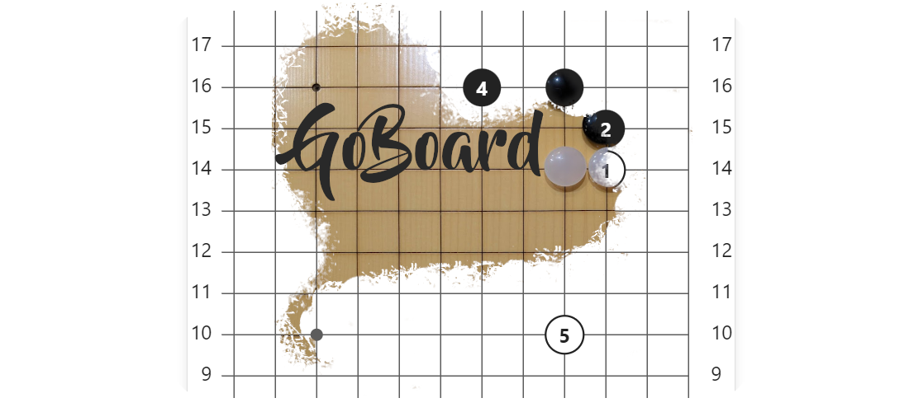

# GoBoard

GoBoard - это плагин для [Obsidian](https://obsidian.md/), рисующий диаграммы [игры Го](https://ru.wikipedia.org/wiki/%D0%93%D0%BE) (так же известна как Вэйци или Падук).


## Установка

В настоящее время плагин GoBoard доступен для бета-теста через [BRAT](https://github.com/TfTHacker/obsidian42-brat).

1. Если у вас ещё нет BRAT, [установитье его](https://obsidian.md/plugins?search=BRAT).
1. В настройках плагина BRAT добавьте репозиторий `https://github.com/dsokolov/goboard`, следуя [инструкции](https://github.com/TfTHacker/obsidian42-brat).
1. Готово, теперь можно рисовать диаграммы!

## Использование

Диаграммы рисуются на основе [markdown codeblock](https://www.codecademy.com/resources/docs/markdown/code-blocks) с указанием синтаксиса `goboard`.

Для примера, следующий код нарисует пустой гобан 9х9:

<!-- goboard: empty-board-9x9 -->
<pre>
```goboard
size 9x9
```
</pre>


Для размещения камней на диаграмме используйте `B <position>` и `W <position>` для чёрных и белых камней соотвественно. Например:

<!-- goboard: moves-first-two -->
<pre>
```gboard
size 9x9
B G7
W C3
```
</pre>


Больше примеров использования смотрите в [examples-ru.md](docs/examples-ru.md).

## Сборка проекта

Собрать проект, включая копирование дистрибутива в хранилище для разработки

```
npm run build
```

Запуск тестов

```
npm test
```

Запуск линтера

```
npm run lint
```

Обновления бейзлайна тестов

```
npm run update-baseline
```

Обновление картинок в документации

```
npm run update-docs
```

## Замечания и предложения

Если вы нашли баг или есть предложения по улучшению - не стасняйтесь [заводить тикеты](https://github.com/dsokolov/goboard/issues)!

## Лицензия

Лицензия MIT - подробности см. в файле [LICENSE](LICENSE).
