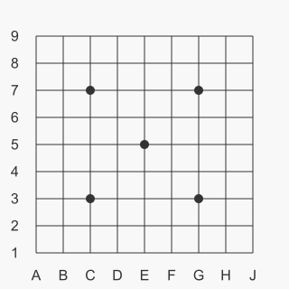
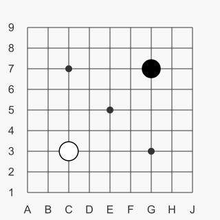
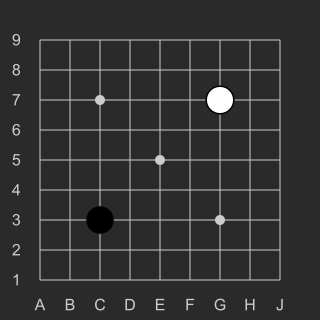

# GoBoard

## Что это?

GoBoard - это плагин для [Obsidian](https://obsidian.md/), рисующий диаграммы [игры Го](https://ru.wikipedia.org/wiki/%D0%93%D0%BE).

## Установка

В настоящее время плагин GoBoard доступен для бета-теста через [BRAT](https://github.com/TfTHacker/obsidian42-brat).

1. Если у вас ещё нет BRAT, [установитье его](https://obsidian.md/plugins?search=BRAT).
1. В настройках плагина BRAT добавьте репозиторий `https://github.com/dsokolov/goboard`, следуя [инструкции]().
1. Готово, теперь можно рисовать диаграммы!

## Использование

Диаграммы рисуются на основе [markdown codeblock](https://www.codecademy.com/resources/docs/markdown/code-blocks) с указанием синтаксиса `goboard`.

Для примера, следующий код нарисует пустой гобан 9х9:

<pre>
```goboard
size 9x9
```
</pre>

 

Для размещения камней на диаграмме используйте `B <position>` и `W <position>` для чёрных и белых камней соотвественно. Например

<pre>
```gboard
size 9x9
B G7
W C3
```
</pre>

 

Больше примеров использования смотрите в [examples.md](docs/examples.md).

## Сборка проекта

Собрать проект, включая копирование дистрибутива в хранилище для разработки

```
npm run build
```

Запуск тестов

```
npm test
```

Обновления бейзлайна тестов

```
npm run update-baseline
```

## Лицензия

[LICENSE](LICENSE)