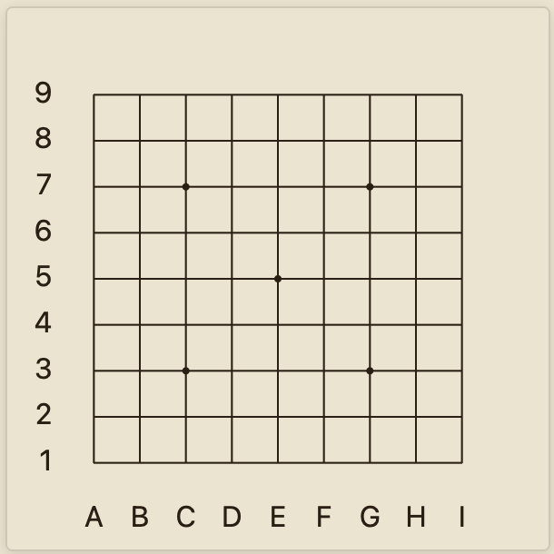
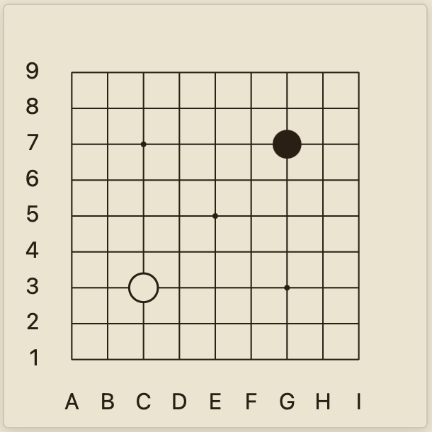

# GoBoard

## What is this?

GoBoard is a plugin for [Obsidian](https://obsidian.md/) that renders [Go game](https://en.wikipedia.org/wiki/Go_(game)) diagrams.

## Installation

Currently, the GoBoard plugin is available for beta testing through [BRAT](https://github.com/TfTHacker/obsidian42-brat).

1. If you don't have BRAT yet, [install it](https://obsidian.md/plugins?search=BRAT).
1. In the BRAT plugin settings, add the repository `https://github.com/dsokolov/goboard`, following the [instructions](https://github.com/TfTHacker/obsidian42-brat).
1. Done, now you can draw diagrams!

## Usage

Diagrams are drawn based on [markdown code blocks](https://www.codecademy.com/resources/docs/markdown/code-blocks) with the `goboard` syntax specified.

For example, the following code will draw an empty 9x9 goban:

<pre>
```goboard
size 9x9
```
</pre>



To place stones on the diagram, use `B <position>` and `W <position>` for black and white stones respectively. For example:

<pre>
```goboard
size 9x9
B G7
W C3
```
</pre>



For more usage examples, see [examples.md](docs/examples.md).
