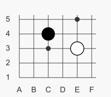

# Примеры использования GoBoard

## Создание пустого гобана

Для создания пустого гобана (поля для игры Го), достаточно в заметке Obsidian создать блок кода, указав в качестве синтаксиса `goboard`, например

<pre>
```goboard
```
</pre>


## Постановка одного камня

Для постановки единичного камня используйте `<B|W> <координата>`, где `B` - чёрный камень, `W` - белый камень. Например постановка чёрного камня в сан-сан:

<pre>
```goboard
B С3
```
</pre>

TODO картинки постановки единичного камня

## Постановка группы камней

Для краткости записи, можно одной строкой поставить сразу несколько камней. Координаты записываются через запятую (будет несколько отдельных камней или групп), через дефис (будет стена или плотная прямоугольная группа) либо комбинацией этих способов. Например, поставим три чёрных камня в ряд, несколько отдельно а белые выложим двумя прямоугольниками.

<pre>
```goboard
B C3-C5, C7, C9
W A9-B7,D8-E6
```
</pre>

TODO картинки постановки групп камней

## Нумерация постановок

Каждый поставленный камень можно отмечать натуральным числом: `<B|W>[(число)] <координата>`. Например постановка в хоси и атака в сан-сан:

<pre>
```goboard
B(1) D4
W(2) C3
```
</pre>

TODO картинка нумерации постановок

## Область видимости (viewport)

Если нет необходимости отображать всю диаграмму гобана (например, рассматривается только небольшая позицию в углу), то можно исполььзовать параметр `viewport <координата1>-<координата2>`:

<pre>
```goboard
size 9x9
viewport A1-F5
B C4
W E3
```
</pre>


