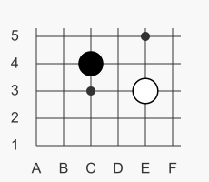

# GoBoard examples

## Viewport

If there is no need to display the entire goban diagram (for example, only a small position in the corner is being considered), you can use the `viewport <coordinate1>-<coordinate2>` parameter:

<pre>
```goboard
size 9x9
viewport A1-F5
B C4
W E3
```
</pre>


